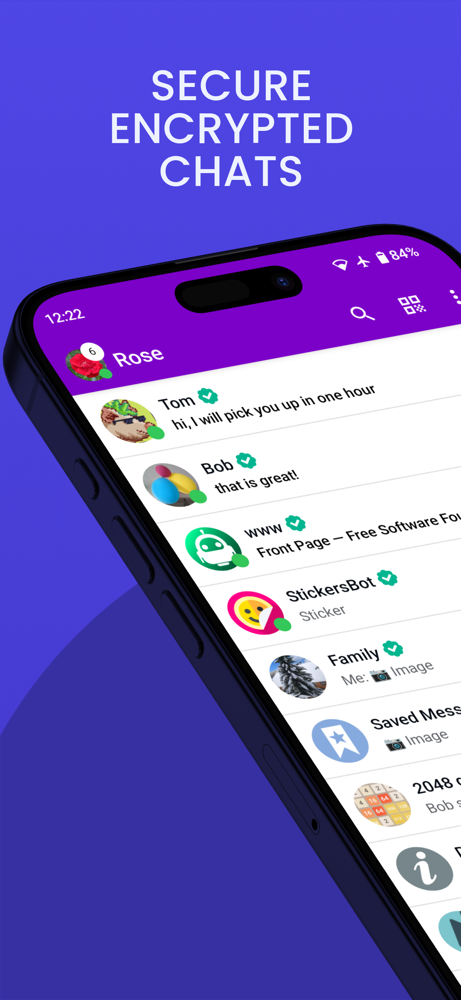
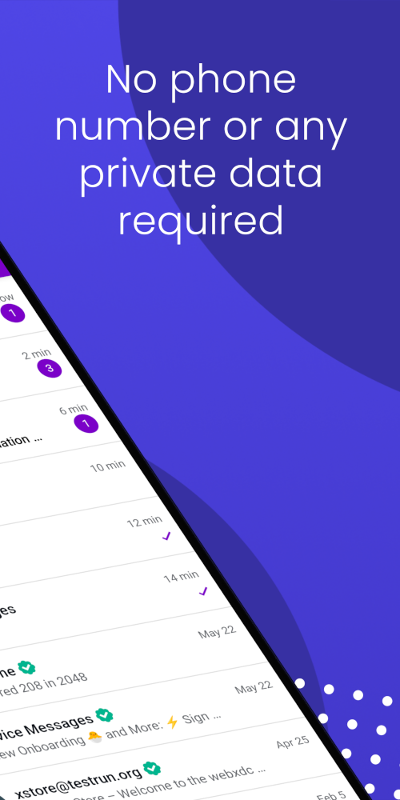

## WhatsDown Android Client

A [Arcane Chat](https://arcanechat.me) client for Android from [Delta Chat](https://delta.chat/).

 

# Modern UI

This app has more user friendly user interface.

# Credits

This app is based on the [official Delta Chat client](https://github.com/deltachat/deltachat-android) with several improvements.

This app uses a [modified](https://github.com/ArcaneChat/core) version of the [Delta Chat Core Library](https://github.com/deltachat/deltachat-core-rust).
