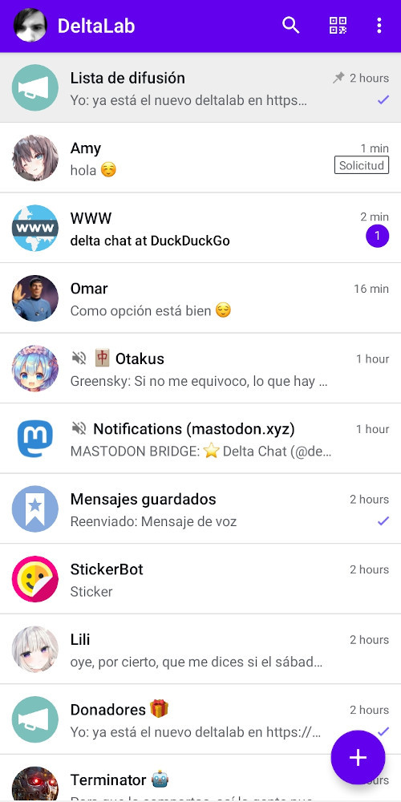
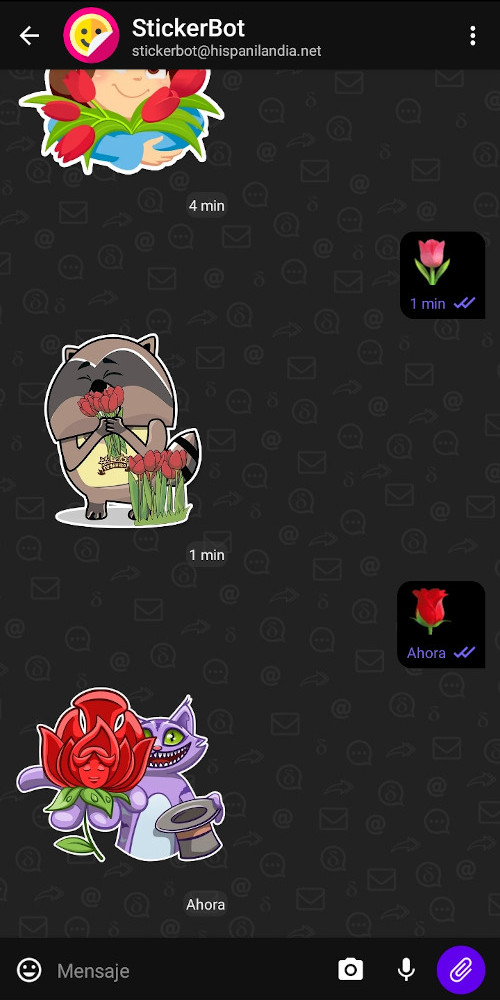

## DeltaLab Android Client

DeltaLab is a [Delta Chat](https://delta.chat/) client for Android.

Or get the latest APK from the [Releases section](https://github.com/adbenitez/deltalab-android/releases/latest).

 

# Credits

DeltaLab is based on the [official Delta Chat client](https://github.com/deltachat/deltachat-android) with some small improvements.

DeltaLab uses a [modified](https://github.com/adbenitez/deltalab-core) version of the [Delta Chat Core Library](https://github.com/deltachat/deltachat-core-rust).

# License

Licensed GPLv3+, see the LICENSE file for details.

Copyright © 2022 DeltaLab contributors.
