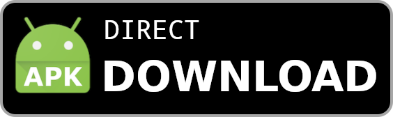

## DeltaLab Android Client

DeltaLab is a [Delta Chat](https://delta.chat/) client for Android.

 

# WebXDC

DeltaLab has some extended support for WebXDC apps:

- `window.webxdc.deltalab` is `true` and can be used by app developers to detect when they can use the DeltaLab-specific features
- `sendToChat()`: the file object parameter also accepts a `type` field that can be one of:
  * `"sticker"`
  * `"image"`
  * `"audio"`
  * `"video"`
  * `"file"` (default if `type` field is not present)
- Inside apps, clicking external links is supported, ex. to open in browser, so you can include links to your website or donation pages.
- `manifest.toml` field: `orientation`, if you set it to `"landscape"` your app will be launched in landscape mode

# Credits

DeltaLab is based on the [official Delta Chat client](https://github.com/deltachat/deltachat-android) with some small improvements.

DeltaLab uses a [modified](https://github.com/adbenitez/deltalab-core) version of the [Delta Chat Core Library](https://github.com/deltachat/deltachat-core-rust).

# License

Licensed GPLv3+, see the LICENSE file for details.

Copyright © 2022 DeltaLab contributors.
